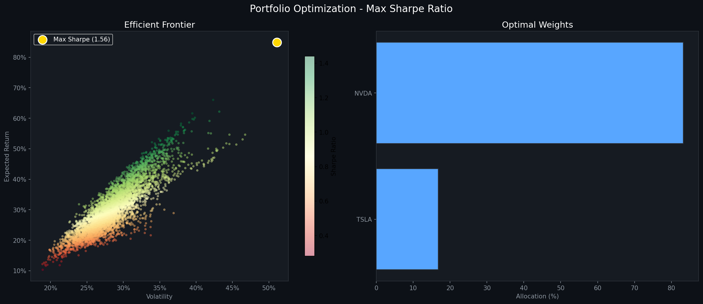

# 📈 Portfolio Optimization Tool

Finds the **Maximum Sharpe Ratio portfolio** from 10 large-cap stocks using Modern Portfolio Theory.

## 🚀 Results
| Metric | Value |
|--------|-------|
| Expected Return | 84.86% |
| Volatility (Risk) | 51.08% |
| Sharpe Ratio | 1.5633 |

## 📊 Optimal Weights
| Stock | Allocation |
|-------|-----------|
| NVDA  | 83.2% |
| TSLA  | 16.8% |

## 📉 Efficient Frontier


## 🛠️ Tech Stack
- `yfinance` — historical price data
- `PyPortfolioOpt` — mean-variance optimization
- `matplotlib` — efficient frontier visualization
- `pandas` / `numpy` — data processing

## ▶️ How to Run
```bash
pip install -r requirements.txt
python portfolio_optimizer.py
```

## 📌 What it does
- Downloads 5 years of price data for 10 stocks
- Computes expected returns and covariance matrix
- Uses PyPortfolioOpt to find optimal weights
- Plots Efficient Frontier with 5,000 Monte Carlo simulations
